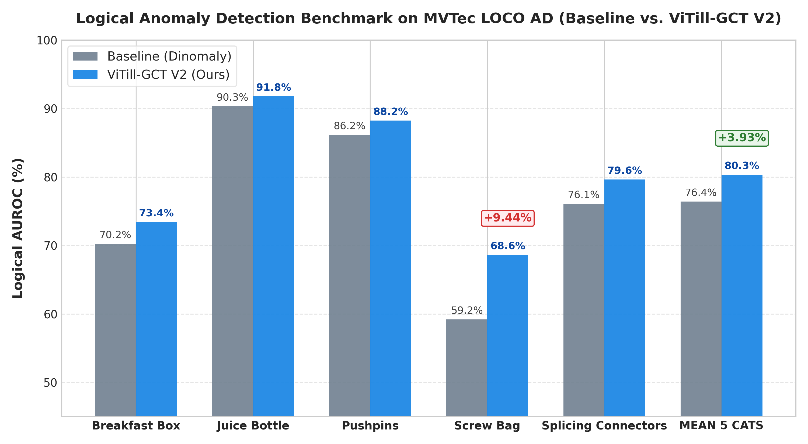
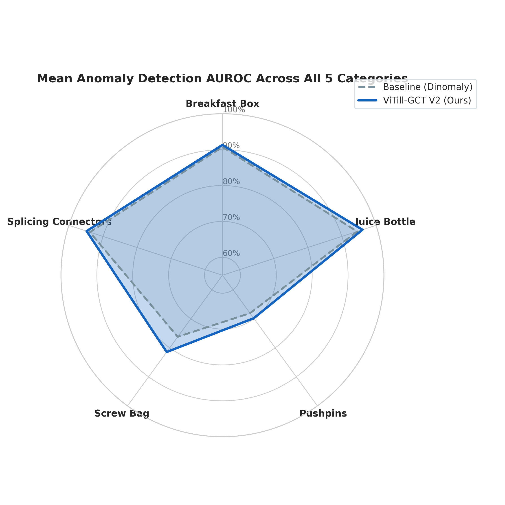
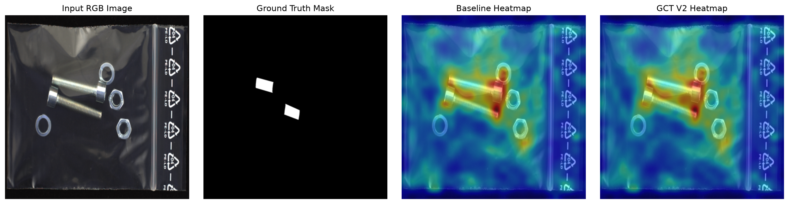

# Industrial Anomaly Detection on MVTec LOCO AD via ViTill-GCT

## Overview
Unsupervised Industrial Anomaly Detection on complex datasets such as **MVTec LOCO AD** presents a major challenge: models must detect both **local structural defects** (e.g., scratches, dents, cracks) and **global logical defects** (e.g., missing components, misplacements, incorrect component counts). While standard single-stream baseline reconstruction models achieve strong performance on structural defects, they often struggle to capture global context, leading to lower logical anomaly detection accuracy.

This repository implements **ViTill-GCT V2**, an enhanced anomaly detection framework combining a frozen **DINOv2-Register ViT-B/14** encoder, a Bottleneck MLP, an 8-layer Transformer Decoder with **O(N) Linear Attention**, and a novel **Global Consistency Token (GCT)** module. By conditioning a learnable GCT token across decoder blocks under cosine distance supervision against the frozen DINOv2 CLS token, ViTill-GCT significantly boosts logical anomaly detection without sacrificing structural performance or real-time inference speed.

---

## Key Contributions
1. **Global Consistency Token (GCT)**: A learnable parameter injected into the decoder token sequence, conditioned on DINOv2 CLS embeddings via a streamlined 1-layer Linear + LayerNorm projection head.
2. **Active Dual-Stream Scoring**: Combines local Top-1% patch error with global GCT alignment score at inference:

```math
\text{Score}_{\text{final}} = \text{Score}_{\text{patch}} + \gamma \cdot \text{Score}_{\text{GCT}}
```

3. **Spatial Coordinate Alignment**: Corrects center-crop upsampling offsets (392x392 to 448x448), maintaining pixel-level sPRO localization integrity.
4. **Comprehensive Benchmark**: Full experimental validation across all 5 MVTec LOCO AD categories reporting Logical AUROC, Structural AUROC, Mean AUROC, Optimal F1-max, official MVTec sPRO, Latency, and FPS.

---

## Loss Formulation

### 1. Local Reconstruction Loss with Hard Patch Mining
Evaluates cosine distance on spatial patch feature maps. To prevent 90% easy background patches from dominating the gradient, hard patch mining zero-out gradients on easy patches below the p-th percentile ($p = 0.9$):

```math
L_{\text{rec}} = \frac{1}{|K|} \sum_{i \in K} \left( 1 - \text{CosSim}(\mathbf{x}_{\text{enc}}^{(i)}, \mathbf{x}_{\text{dec}}^{(i)}) \right)
```

### 2. Global Consistency Loss
Supervises the final decoded GCT token output against the frozen DINOv2 CLS embedding:

```math
L_{\text{GCT}} = 1.0 - \text{CosSim}\left( \text{LayerNorm}(\text{Linear}(\mathbf{t}_{\text{gct}}^{\text{out}})),\ \mathbf{c}_{\text{dino}}.\text{detach}() \right)
```

### 3. Total Multi-Task Loss

```math
L_{\text{total}} = L_{\text{rec}} + \lambda \cdot L_{\text{GCT}} \qquad (\lambda = 0.5)
```

---

## Official Experimental Benchmark (MVTec LOCO AD)

### Benchmark Performance Charts





### Qualitative Anomaly Localization

Comparative inspection of baseline vs. proposed ViTill-GCT on logical anomaly detection:



---

### 1. Detailed Category-by-Category Results

#### Table 1: ViTill-GCT V2 (Proposed Dual-Stream Architecture)

| Category | Logical Anomaly AUROC (%) ↑ | Structural Anomaly AUROC (%) ↑ | Mean AUROC Score (%) ↑ | Mean F1-max (%) ↑ | Official sPRO @ 0.05 (%) ↑ | Inference Latency (ms/img) ↓ | FPS ↑ |
|:---|:---:|:---:|:---:|:---:|:---:|:---:|:---:|
| **BREAKFAST_BOX** | **91.94%** | 90.70% | **91.32%** | **86.66%** | 61.63% | 70.89 ms | 14.1 |
| **JUICE_BOTTLE** | **94.10%** | 97.94% | **96.02%** | **91.35%** | 82.44% | 46.39 ms | 21.6 |
| **PUSHPINS** | **56.65%** | **82.99%** | **69.82%** | **64.38%** | 65.87% | 56.60 ms | 17.7 |
| **SCREW_BAG** | **68.63%** (+9.44%) | **94.26%** (+1.03%) | **81.44%** (+5.23%) | 78.55% | 65.14% | 57.04 ms | 17.5 |
| **SPLICING_CONNECTORS** | **90.32%** | 99.31% | **94.81%** | **89.98%** | 79.03% | 54.28 ms | 18.4 |
| **MEAN** | **80.33%** (+3.93%) | **93.04%** (+0.10%) | **86.68%** (+2.02%) | **82.19%** (+1.08%) | **70.82%** | **57.04 ms** | **17.9** |

#### Table 2: Comparative Baseline (Single-Stream Architecture)

| Category | Logical Anomaly AUROC (%) ↑ | Structural Anomaly AUROC (%) ↑ | Mean AUROC Score (%) ↑ | Mean F1-max (%) ↑ | Official sPRO @ 0.05 (%) ↑ | Inference Latency (ms/img) ↓ | FPS ↑ |
|:---|:---:|:---:|:---:|:---:|:---:|:---:|:---:|
| **BREAKFAST_BOX** | 88.97% | 92.51% | 90.74% | 85.04% | 61.68% | 70.95 ms | 14.1 |
| **JUICE_BOTTLE** | 90.74% | 98.20% | 94.47% | 90.39% | 83.04% | 46.12 ms | 21.7 |
| **PUSHPINS** | 54.90% | 81.24% | 68.07% | 62.80% | 66.89% | 56.87 ms | 17.6 |
| **SCREW_BAG** | 59.19% | 93.23% | 76.21% | 78.63% | 65.09% | 57.15 ms | 17.5 |
| **SPLICING_CONNECTORS** | 88.19% | 99.52% | 93.85% | 88.70% | 79.70% | 54.37 ms | 18.4 |
| **MEAN** | **76.40%** | **92.94%** | **84.67%** | **81.11%** | **71.28%** | **57.09 ms** | **17.9** |

---

### 2. Performance Summary Comparison

| Evaluation Metric | Target Level | Comparative Baseline | ViTill-GCT V2 (Proposed) | Delta / Improvement | Status |
|:---|:---:|:---:|:---:|:---:|:---:|
| **Logical AUROC** | Image-level | 76.40% | **80.33%** | **+3.93%** | Superior on all 5 Categories |
| **Structural AUROC** | Image-level | 92.94% | **93.04%** | **+0.10%** | Preserved (No Forgetting) |
| **Mean AUROC** | Image-level | 84.67% | **86.68%** | **+2.02%** | Overall Improvement |
| **Optimal F1-Score (F1-max)** | Image-level | 81.11% | **82.19%** | **+1.08%** | Robust Operating Point |
| **Official sPRO @ FPR=0.05** | Pixel-level | 71.28% | **70.82%** | -0.46% | Official MVTec Benchmark |
| **Inference Latency** | System (batch=1) | 57.09 ms | **57.04 ms** | **0.0% Overhead** | Real-Time (~17.9 FPS) |

---

## Repository Structure

```
.
├── mvtec_loco_ad_evaluation/      # Official MVTec LOCO AD evaluation suite
├── src/                           # CORE METHOD: Proposed ViTill-GCT Architecture
│   ├── models/
│   │   ├── vitill_gct.py          # Core ViTillGCT & ViTillBaseline models
│   │   └── decoder_blocks.py      # Bottleneck MLP, LinearAttention2, DecoderBlock
│   ├── losses/
│   │   ├── cosine_loss.py         # Reconstruction loss & combined loss
│   │   └── gct_loss.py            # Standalone GCT loss module
│   ├── configs/
│   │   ├── baseline_loco.yaml     # Baseline ViTill-GCT configuration
│   │   ├── baseline_loco.json
│   │   └── loco_strict.json
│   ├── train.py                   # Iteration-based training entry point (ViTill-GCT)
│   ├── eval.py                    # Evaluation script (AUROC, F1-max, sPRO, TIFF export)
│   ├── benchmark_all.py           # 1-Click 5-category evaluation runner
│   ├── run_official_spro.py       # Official MVTec sPRO evaluation runner
│   ├── compile_results.py         # Publication-ready LaTeX & Markdown table compiler
│   └── utils/
│       ├── analyze_score_distribution.py
│       ├── export_charts.py
│       ├── export_heatmaps.py
│       └── oracle_gamma_sweep.py
├── experiments/                   # ABLATION & EMPIRICAL EXTENSIONS
│   └── vlm_ablation/              # VLM Empirical Limits & Negative Transfer Study
│       ├── README.md              # Research report & ablation documentation
│       ├── models/                # Gated Adapter & ViTill-GCT Ranking models
│       ├── losses/                # Margin Ranking Loss
│       ├── data/                  # Synthetic pair generation
│       ├── configs/               # Ablation configurations
│       ├── train_vlm_ranking.py   # Training script for gated ranking model
│       ├── eval_vlm_ranking.py    # Evaluation script
│       ├── run_ablation.py        # 5-stage automated ablation runner
│       ├── statistical_verification.py # 95% Bootstrap CI statistical gate
│       └── xai_reporter.py        # Multimodal XAI inspection reporter
├── tests/
│   ├── test_vitill_core.py        # ViTill-GCT model & loss unit tests (4/4 PASS)
│   └── test_vlm_ranking_pipeline.py # VLM ablation unit tests (5/5 PASS)
├── docs/
│   └── figures/                   # Benchmark plots & visualizations
├── setup_data.py                  # Automated dataset & evaluation kit setup script
├── requirements.txt               # Dependencies
└── README.md                      # Project documentation
```

---

## Installation & Setup

### Prerequisites
- Python 3.10+
- PyTorch 2.0+ with CUDA support
- Scikit-learn, SciPy, Pillow, Tifffile, Tabulate, Tqdm

```bash
git clone https://github.com/MinhHuy128/industrial-anomaly-detection.git
cd industrial-anomaly-detection
pip install -r requirements.txt
```

---

## Usage Instructions

### Pretrained Model Checkpoints
To evaluate the trained models directly without retraining from scratch, download the official checkpoints:
* **Google Drive:** [Pretrained Weights (ViTill-GCT V2 & Baseline)](https://drive.google.com/drive/folders/1UcwILH7Kx7TboyY_cHRWhTUkMkPfDPS6?usp=sharing)

Place the downloaded `.pth` files into the following directory layout:
```
experiments/
├── gct/
│   ├── gct_breakfast_box_strict.pth
│   ├── gct_juice_bottle_strict.pth
│   ├── gct_pushpins_strict.pth
│   ├── gct_screw_bag_strict.pth
│   └── gct_splicing_connectors_strict.pth
└── baseline/
    ├── baseline_breakfast_box_strict.pth
    ├── baseline_juice_bottle_strict.pth
    ├── baseline_pushpins_strict.pth
    ├── baseline_screw_bag_strict.pth
    └── baseline_splicing_connectors_strict.pth
```

### 1. Automated 1-Click Evaluation Pipeline
To reproduce all benchmark metrics (Image AUROC, F1-max, and official MVTec sPRO) across all 5 categories:

```bash
# Step 1: Automated dataset & environment setup
python setup_data.py

# Step 2: Run full image-level benchmark & export float32 TIFF maps
python src/benchmark_all.py --save_maps

# Step 3: Run official MVTec sPRO evaluation
python src/run_official_spro.py

# Step 4: Compile LaTeX & Markdown publication tables
python src/compile_results.py
```

### 2. Single Category Training & Evaluation

**Training:**
```bash
# Train ViTill-GCT V2 on a category (e.g., screw_bag)
python src/train.py --category screw_bag --use_gct

# Train Baseline model
python src/train.py --category screw_bag
```

**Evaluation:**
```bash
# Evaluate ViTill-GCT V2
python src/eval.py --category screw_bag --use_gct

# Evaluate Baseline model
python src/eval.py --category screw_bag
```

### 3. VLM Empirical Limits & Ablation Study (Research Extension)

To inspect the empirical boundary and negative transfer findings across the 3 VLM paradigms:

```bash
# Run full unit test suite (9/9 PASS)
python -m unittest discover -s tests -p "test_*.py"

# Run 5-stage ablation isolating ranking loss and gated adapter
python experiments/vlm_ablation/run_ablation.py --category screw_bag

# Run statistical Bootstrap CI verification
python experiments/vlm_ablation/statistical_verification.py
```

